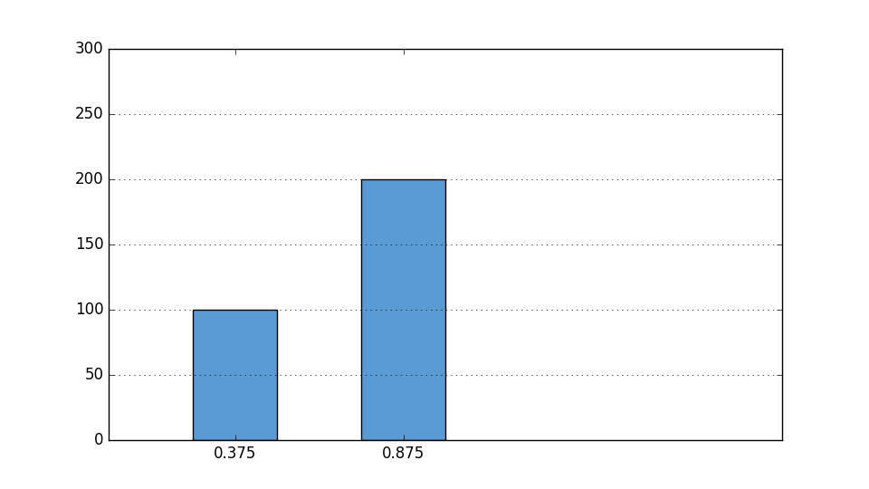

# Matplotlib

## 1. matplotlib.pyplot.bar指定x的位置时是指定直方图的那个地方？

示例：
```python
import matplotlib.pyplot as plt

x = [0.250, 0.750]
y = [100, 200]
xticks = [0.375, 0.875]

fig, ax = plt.subplots()
ax.set_xlim(0, 2)
ax.set_ylim(0, 300)
ax.set_xticks(xticks)
ax.set_xticklabels(xticks)
ax.yaxis.grid(True)
ax.bar(x, y, color='#5B9BD5', width=0.25)
fig.set_size_inches(9.6, 5.4)
```



问：你讲这个x到底要传入哪个位置？

答：直方图不是跟x轴有两个交点嘛，传的是左边那个交点的位置，注意：千万不能传成中间的位置。